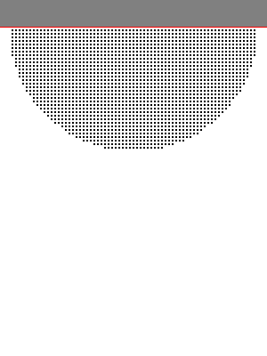

# Basic-Simulation Examples
These two examples are simple demonstrations of Lagrangian-style simulations
using a potential field for fluids (similar to a lennard jones potential)
and springs for soft-body simulations.

Both simulations have controls in the top bar. The simulation is not really
fast (its JS) but you can replay it at the normal speed. GIF generation might
kill your browser.. be careful.

You can probably increase the performance of these simulations by a factor of 1000
or so simply by using fitting static types, no functional concepts (they
are comparatively slow if there isn't any fancy translation unit) and simply
a compiled language.

<h2><a href="https://littlehelicase.github.io/basic_simulations/water.html">Fluid via microscopic-potential</a></h2>

A simple fluid that uses
a slightly different potential than the standard lennard jones potential. There
is a top layer of fixed particles to simulate the "stickyness".

<h2><a href="https://littlehelicase.github.io/basic_simulations/def.html">Soft-Body via springs</a></h2>

A jelly box that can deform plastically (it restores its original form). The floor is also
done with a simple spring. Usually you have to calculate the
contact normal, but the floor is a simple plane and thus the contact
normal is always upwards.
(It takes approx. 1500 steps until you can see the box.)